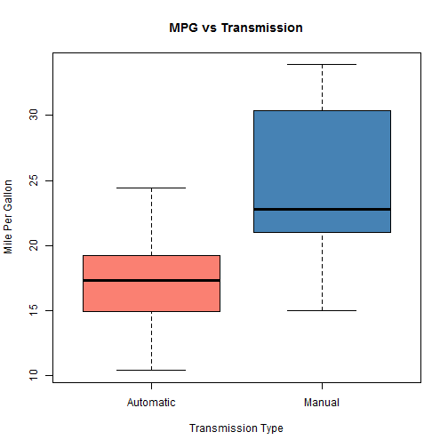

# Effect of Transmission Type on MPG of Cars
Create by Trent Lin Dec. 24 2014

## Executive Summary
In this report we gather data by Motor Trend, a magazine about the automobile industry. Looking at a data set of a collection of cars, we are interested in exploring the relationship between a set of variblaes and miles per gallon(MPG)(outcome). we are particullaly in the follwing two questions:
* "Is an automatic or manual transmission better for MPG" ?
* "Quantify the MPG difference between automatic and manual transmissions"
In this report, I applied simple linear regression model to show the relationships between the regression variables. Expecially focus on "mpg" and "am" variables.We found that there ia siginificant relationship between "mpg" and "am" where "munual" transmission has a siginificant increase in "mpg" versus "automatic".
## Summary of data
The data was extracted from the 1974 Motor Trend US magazine, and comprises fuel consumption and 10 aspects of automobile design and performance for 32 automobiles (1973¡V74 models).The qualitative variables such as number of cylinders and gears were converted to factors. We show the description of the variables in the appendix.

## Exploratory analysis
In Figure 1
I calculate the mean and standard deviation for "mpg" between different transmission type, we found that the mean and standard deviation for "mpg" are significant different between "automatic" and "manual" transmission. Then I plot a boxplot,the boxplot show the different between automatic and manual for mile per
gallon(MPG). It clear shows that manual transmission produce more MPG.
## Model
In Figure 2
We use all variables to fit a linear model to determine which variables should be used in the final model. Then we found that "am","wt" and "hp" have strong relationship with mpg. 
In Figure 3 
We create two linear models comparing a simple linear regression for "mpg" as funtion of "am" and a linear regression with "wt" and "hp" added to see the effect.
In Figure 4
we found that adding "wt" and " hp" variables increase the Adjusted
R-squared from  36% to 83%. Thus, including "wt" and "hp" in the model captures an acceptable number of contributors and therefore will be used as my linear model going forward. Then we perform an ANOVA of the two models for further insight of our decision.
#### anova(ammodel,adjustmodel)
We found that the p-value is very small, it means that we can highly significant to reject the null hypothesis that the counfounder variable "hp" & "wt" don't contribute to the original "am" model.
## Residuals & Diagnostics
In Figure 5 I create a residual plot and histogram of residual to diagnose whether the resudual fitting the normal distribution. 
*The Rediuals vs Fitted plot show no pattern between Residuals and  Fitted values means that this regression model is well fit.
*The Normal Q-Q plot shows that the residual is fitting normal distribution.
*In both the Scale-Location plot and Residual vs Leverage plots, the points in the group don't too far from the center means that there is no much leverage.
## Statistical Inference
In Figure 6 I conduct a t-test , based on the t-test we show that the p-value is 0.001374 < 0.05. We significantly reject the null hypothesis which mpg distribution for manual and automatic transmission are the same
## Conclusion
In this report we have showns that there is a significant differece in "Miles per Gallon" (mpg) between "Automatic" and "Manual" transmission.
We have perform explortory and shows the model selection strategy, we also plot to diagnose the residuales and conduct t-test for statistical inference.It addition the mean of mpg different between "Manul" and "Automatic" transmission is 7.24.
## Figure1
create boxplot to explore the MPG between different transmission

```r
summary(mtcars$mpg[mtcars$am=="Automatic"] )
```

```
##    Min. 1st Qu.  Median    Mean 3rd Qu.    Max. 
##    10.4    15.0    17.3    17.1    19.2    24.4
```

```r
summary(mtcars$mpg[mtcars$am=="Manual"] )
```

```
##    Min. 1st Qu.  Median    Mean 3rd Qu.    Max. 
##    15.0    21.0    22.8    24.4    30.4    33.9
```

```r
sd(mtcars$mpg[mtcars$am=="Automatic"])
```

```
## [1] 3.834
```

```r
sd(mtcars$mpg[mtcars$am=="Manual"])
```

```
## [1] 6.167
```

```r
boxplot(mpg ~ am, data = mtcars,
        xlab = "Transmission Type", ylab = "Mile Per Gallon",
        main = "MPG vs Transmission", col = c("salmon","steelblue"))
```

 
## Figure2
Using all variables to fit model to find the most significant predictors

```r
allInmodel <-lm(mpg ~., data = mtcars)
summary(allInmodel)$coef
```

```
##             Estimate Std. Error  t value Pr(>|t|)
## (Intercept) 23.87913   20.06582  1.19004  0.25253
## cyl6        -2.64870    3.04089 -0.87103  0.39747
## cyl8        -0.33616    7.15954 -0.04695  0.96317
## disp         0.03555    0.03190  1.11433  0.28267
## hp          -0.07051    0.03943 -1.78835  0.09393
## drat         1.18283    2.48348  0.47628  0.64074
## wt          -4.52978    2.53875 -1.78426  0.09462
## qsec         0.36784    0.93540  0.39325  0.69967
## vs1          1.93085    2.87126  0.67248  0.51151
## amManual     1.21212    3.21355  0.37719  0.71132
## gear4        1.11435    3.79952  0.29329  0.77332
## gear5        2.52840    3.73636  0.67670  0.50890
## carb2       -0.97935    2.31797 -0.42250  0.67865
## carb3        2.99964    4.29355  0.69864  0.49547
## carb4        1.09142    4.44962  0.24528  0.80956
## carb6        4.47757    6.38406  0.70137  0.49381
## carb8        7.25041    8.36057  0.86722  0.39948
```
## Figure3
Comparing two model with "am"" no adjusetd and add "wt" and "hp"

```r
ammodel <- lm(mpg ~ am, data = mtcars)
adjustmodel <- lm(mpg ~ am + wt + hp, data = mtcars)
```
## Figure4
calculate R squared in two models and perform the ANOVA.

```r
summary(ammodel)$r.squared
```

```
## [1] 0.3598
```

```r
summary(adjustmodel)$r.squared
```

```
## [1] 0.8399
```

```r
anova(ammodel,adjustmodel)
```

```
## Analysis of Variance Table
## 
## Model 1: mpg ~ am
## Model 2: mpg ~ am + wt + hp
##   Res.Df RSS Df Sum of Sq  F  Pr(>F)    
## 1     30 721                            
## 2     28 180  2       541 42 3.7e-09 ***
## ---
## Signif. codes:  0 '***' 0.001 '**' 0.01 '*' 0.05 '.' 0.1 ' ' 1
```
## Figure5
Plot to diagnose inear model residual 

```r
par(mfrow = c(2,2))
plot(adjustmodel)
```

 
## Figure6
conduct a t-test

```r
t.test(mpg ~ am, data = mtcars)
```

```
## 
## 	Welch Two Sample t-test
## 
## data:  mpg by am
## t = -3.767, df = 18.33, p-value = 0.001374
## alternative hypothesis: true difference in means is not equal to 0
## 95 percent confidence interval:
##  -11.28  -3.21
## sample estimates:
## mean in group Automatic    mean in group Manual 
##                   17.15                   24.39
```
